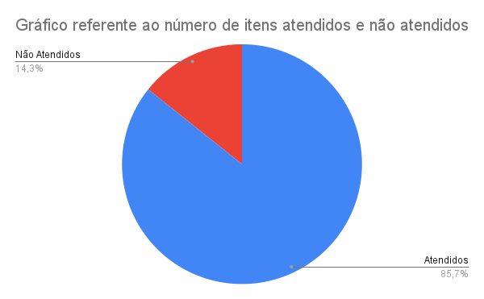

# Verificação do Perfil de Usuário

## 1. Introdução

Neste artefato será feita a checklist de avaliação do artefato sobre 
[Perfil de Usuário](/analise_de_requisitos/perfil_do_usuario.md),
utilizando a metodologia e as estratégias descritas no documento de [Verificação](/analise/verif_principal.md).

- Autor do documento: Leonardo Vitoriano.
- Inspetor: Bernardo Pissutti.

## 2. Verificação

### 2.1 Preparação

O *checklist* da tabela 1 foi montado para verificar a qualidade do artefato.

| Item                                                                                                                       | Identificador |
|----------------------------------------------------------------------------------------------------------------------------|---------------|
| O perfil de usuário detalha os objetivos do usuário?                                                                       | 1             |
| Foi identificado caracteristicas como cargo, função, experiência, nível de instrução, atividades principais, faixa etária? | 2             |
| Foi identificado o estudo no qual o perfil de usuário se baseia?                                                           | 3             |
| Os perfis de usuário foram categorizados em grupos, com base em suas semelhanças?                                          | 4             |
| Foi identificado o publico alvo do site?                                                                                   | 5             |
| Foi utilizado um termo de consentimento para os metodos empregados?                                                        | 6             |
| O roteiro identifica a familiaridade do participante com a tecnologia?                                                     | 7             |

_Tabela 1: Itens e identificadores da verificação do Perfil de Usuário_

_Obs: a pergunta 7 foi retirada da checklist do projeto [Prefeitura de Concordia](https://interacao-humano-computador.github.io/2021.1-Prefeitura-de-Concordia/verificacao/entrevistas/)_

### 2.2 Inspeção

A inspeção foi realizada pelo integrante Bernardo Pissutti no dia 20/08/2022.
O resultado do inspeção dos itens levantados consta na _tabela 2_ abaixo.

| Item | Resposta |
|------|----------|
| 1    | ✅        |
| 2    | ✅        |
| 3    | ✅        |
| 4    | ✅        |
| 5    | ✅        |
| 6    | ✅        |
| 7    | ❌        |

_Tabela 2: resultado do checklist_

O seguinte gráfico de pizza foi construído utilizando da Ferramenta: 
Google Sheets para melhor rastreamento dos itens nas próximas fases.

|                      |
|--------------------------------------------------------------------------------|
| Figura 1: Gráfico de Itens atendidos e não atendidos; Fonte: autoria própria.  |

Como a inspeção verificou que o artefato não satisfaz o item 7 da checklist, portanto há a necessidade de correções.

## Referências Bibliográficas

Barbosa, S. D. J.; Silva, B. S. da; Silveira, M. S.; Gasparini, I.; Darin, T.; Barbosa, G. D. J. (2021) Interação Humano-Computador
e Experiência do usuário. Autopublicação. ISBN: 978-65-00-19677-1.R

## Hitórico de Versões

| Versão  | Data       | Descrição                             | Autor              | Revisor |
|---------|------------|---------------------------------------|--------------------|---------|
| 1.0     | 20/08/2022 | Criação da página                     | Bernardo Pissutti  | Cicero  |
| 1.1     | 21/08/2022 | Adequação da página pra o novo modelo | Bernardo Pissutti  | Cicero  |
