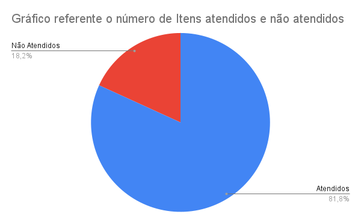
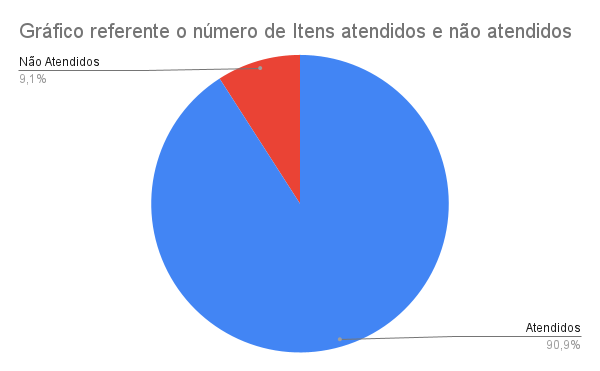

# Verificação de Storyboards

## 1. Introdução

Neste artefato será feita a verificação da
[Storyboards](/nivel1/storyboard.md) utilizando a metodologia e as estratégias descritas no documento
de [*Verificação*](../verif_principal.md)

- Autor(es) do documento: Guilherme Brito.
- Inspetor(es): Leonardo Vitoriano.

## 2. Metodologia

Como descrito no documento [Verificação](/analise/verif_principal.md), o método escolhido foi o da inspeção.
A inspeção consiste em um tipo de checagem que elenca itens para verificação. O seu **objetivo** é identificar se as
condições para a execução das tarefas estão em conformidade com o padrão de qualidade.

## 2. Verificação

### 2.1 Preparação

Tendo como base a definição de Barbosa (2021) sobre as principais características e elementos no qual uma Storyboards deve conter, foi possível criar uma checklist para avaliar o artefato de Storyboards.

O *checklist* da tabela 1 foi montado para verificar a qualidade do artefato.

| Item                                                                  | Identificador |
| --------------------------------------------------------------------- | ------------- |
| O documento possui versionamento?                                     |      1        |
| Existe uma introdução ao conceito abordado?                           |      2        |   
| Há uma ordem lógica entre as estruturas?                              |      3        | 
| Elementos gráficos estão acompanhados de legendas?                    |      4        |   
| É possivel visualizar o fluxo do storyboard a partir das tarefas?     |      5        |      
| O storyboard ilustra um objetivo?                                     |      6        |    
| O storyboard é baseado em uma análise de tarefas conceitual?          |      7        |      
| O objetivo do storyboard é alcançado?                                 |      8        |             
| O storyboard possue ambiente?                                         |      9        |    
| Pessoas participam do storyboard?                                     |      10       |      
| É demonstrado a satisfação da pessoa ao concluir o objetivo?          |      11       |     
_Tabela 1: Itens e identificadores da verificação de Storyboards_

### 2.2 Inspeção

#### Storyboard 1 

A inspeção do artefato foi realizada no dia 21 de Agosto às 19h. Após a inspeção, o 
resultado do checklist foi construído e ele pode ser visto na _tabela 2_.

| Item         | Situação   |
|:-------------|:----------:|
| 1            |     ✅      |
| 2            |     ✅      |            
| 3            |     ✅      |
| 4            |     ✅      |
| 5            |     ✅      |
| 6            |     ✅      |    
| 7            |     ❌      |    
| 8            |     ✅      |
| 9            |     ✅      |    
| 10           |     ✅      |                
| 11           |     ❌      |
_Tabela 2: Checklist de Verificação do Storyboard 1_

O gráfico de pizza compilando a porcentagem de itens atendidos e não atendidos consta na _figura 1_ abaixo.

|                |
|----------------------------------------------------------------------|
| Figura 1: Gráfico de Itens atendidos e não atendidos do Storyboard 1; Fonte: autoria própria. |

Tomando como base a checklist construída, observa-se que o Storyboard 1 está bom, mas carece de atenção quanto aos itens 7 e 11, portanto, esses itens precisam ser corrigidos.

### Storyboard 2

A inspeção do artefato foi realizada no dia 21 de Agosto às 19h15. Após a inspeção, o 
resultado do checklist foi construído e ele pode ser visto na _tabela 3_.

| Item                                                              | Situação |
|:------------------------------------------------------------------|:--------:|
| 1  |    ✅    |
| 2  |    ✅    |            
| 3  |    ✅    |
| 4  |    ✅    |
| 5  |    ✅    |
| 6  |    ✅    |    
| 7  |    ✅    |    
| 8  |    ✅    |
| 9  |    ✅    |    
| 10 |    ✅    |                
| 11 |    ❌    |
_Tabela 3: Checklist de Verificação do Storyboard 2_

O gráfico de pizza compilando a porcentagem de itens atendidos e não atendidos consta na _figura 2_ abaixo.

|  |
|---------------------------------------------------------|
| Figura 2: Gráfico de Itens atendidos e não atendidos do Storyboard 2   |

Tomando como base a checklist construída, observa-se que o Storyboard 2 está bom, mas carece de atenção quanto aos item 11, portanto, esse item precisa ser corrigido.

## Referências Bibliográficas

Barbosa, S. D. J.; Silva, B. S. da; Silveira, M. S.; Gasparini, I.; Darin, T.; Barbosa, G. D. J. (2021)
Interação Humano-Computador e Experiência do usuário. Autopublicação. ISBN: 978-65-00-19677-1.R

## Histórico de Versões

| Versão  | Data       | Descrição                                    | Autor              | Revisor   |
|---------|------------|----------------------------------------------|--------------------|-----------|
| 1.0     | 21/08/2022 | Criação do Artefato                          | Leonardo Vitoriano | Guilherme |
| 1.1     | 22/08/2022 | Refatorando para modelo único de verificação | Leonardo Vitoriano | Guilherme |