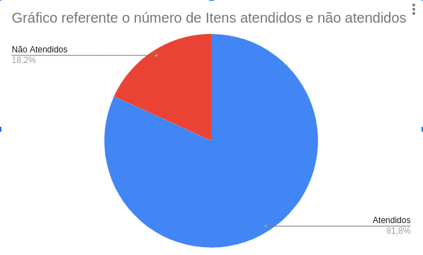

# Verificação - Guia de Estilo

## 1. Introdução

Neste artefato será feita a verificação do artefato
sobre [Guia de Estilo](/analise_de_requisitos/guia_de_estilo.md) utilizando a metodologia descrita no documento
[Verificação](../verif_principal.md).

- Autor do documento: Bernardo Pissutti e Arthur José.
- Inspetor: Guilherme Brito.

## 2. Verificação

### 2.1. Preparação

Primeiramente, é preciso construir uma série de perguntas que permitem avaliar a qualidade do documento produzido.
Após análises de diversos checklists produzidos pelos grupos de projetos de semestres anteriores, foi possível coletar
as perguntas mais pertinentes e úteis ao contexto. As perguntas elicitadas podem ser vistas na tabela abaixo, contendo o
item e seu respectivo identificador.

| Item                                                                                          | Identificador |
|-----------------------------------------------------------------------------------------------|---------------|
| O documento possui versionamento?                                                             | 1             |
| O documento está gramaticalmente correto?                                                     | 2             |
| Existe uma introdução ao conceito abordado?                                                   | 3             |
| Há uma ordem lógica entre as estruturas?                                                      | 4             |
| Elementos gráficos estão acompanhados de legendas?                                            | 5             |
| Existem imagens do sistema analisado para referência visual?                                  | 6             |
| Existe referência de cores do site analisado no guia de estilo apresentado? (Paleta de Cores) | 7             |
| É apresentada a tipografia utilizada pelo site?                                               | 8             |
| O guia de estilo do site apresenta algum padrão pré-estabelecido?                             | 9             |
| Se sim, esse padrão é apresentado no documento?                                               | 10            |
| Possui especificação do layout?                                                               | 11            |

_Tabela 1: Itens e identificadores da verificação do Guia de Estilo_

### 2.2 Inspeção

A inspeção do artefato foi realizado pelo membro: Guilherme Brito, no dia 21 de Agosto às 16h. Após a inspeção, a
checklist foi construída e ela pode ser vista na _Tabela 2_.

| Identificador | Situação |
|:--------------|:--------:|
| 1             |     ✅     |
| 2             |     ❌     |
| 3             |      ✅    |
| 4             |      ❌    |
| 5             |     ✅     |
| 6             |      ✅    |
| 7             |     ✅     |
| 8             |     ✅     |
| 9             |    ✅      |
| 10            |     ✅     |
| 11            |     ✅      |

_Tabela 2: Checklist de Verificação do Artefato: Guia de Estilo_

O seguinte gráfico de Pizza foi construído utilizando da Ferramenta: Google Sheets para melhor rastreamento dos itens
nas próximas fases e pode ser visto na Figura 1.

|  |
|---------------------------------------------------------|
| Figura 1: Gráfico de Itens atendidos e não atendidos    |

---

Tomando como base a checklist construída, observa-se que o artefato está bom, mas carece de atenção quanto aos erros
gramaticais e não segue uma estrutura muito lógica entre os itens, alguns itens importantes são apresentados no fim do
documento.

### 2.3 Correção

Um membro será definido para executar as correções indicadas nesse documento e também tomará como base os relatórios
gerados pela monitora da matéria e comentários feitos pelo professor nas apresentações dos pontos de controle.

## Referências Bibliográficas

SERRANO, Maurício; SERRANO, Milene. Requisitos - Aula 20. Material apresentado para a disciplina de Requisitos de
Software no curso de Engenharia de Software da UnB, FGA.

Fagan, M. (1976) Design and Code Inspections to Reduce Errors in Software Development. IBM Systems Journal, 15, 182-211.

## Histórico de Versões

| Versão | Data       | Descrição                              | Autor           |
|--------|------------|----------------------------------------|-----------------|
| 1.0    | 21/08/2022 | Construção do Artefato                 | Guilherme Brito |
| 1.1    | 22/08/2022 | Ajuste de Documento ao Padrão definido | Guilherme Brito |
