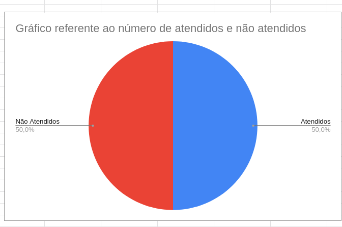

# Verificação das Metas de usabilidade

## 1. Introdução

Neste artefato será feita a verificação das
[_Metas de usabilidade_](/analise_de_requisitos/metas_de_usabilidade.md) utilizando a metodologia e as estratégias descritas no documento
de [_Verificação_](analise/verif_principal.md)

- Autor do documento: Leonardo Vitoriano e Nicolas.
- Inspetor: Cícero Fernandes.

## 2. Verificação

### 2.1 Preparação

O _checklist_ da tabela 1 foi montado para verificar a qualidade do artefato.

| Item                                                                       | Identificador |
| -------------------------------------------------------------------------- | ------------- |
| As metas de usabilidade são citadas e definidas?                           | 1             |
| Existe análise das metas no sistema?                                       | 2             |
| É apresentada as metas de usabilidade que devem ser alcançadas no projeto? | 3             |
| É explicada a razão de quais das metas de usabilidade serão utilizadas?    | 4             |

_Tabela 1: Itens e identificadores da verificação das metas de usabilidade_

### 2.2 Inspeção

O resultado do checklist dos itens levantados consta na _tabela 1_ abaixo.

| Identificador | Situação |
| ------------- | -------- |
| 1             | ✅       |
| 2             | ✅       |
| 3             | ❌       |
| 4             | ❌       |

O gráfico de pizza compilando a porcentagem de itens atendidos e não atendidos consta na _figura 1_ abaixo.

|    |
| ---------------------------------------------------- |
| Figura 1: Gráfico de Itens atendidos e não atendidos |

Como pode ser aferido pelo gráfico, metade dos requisitos não foram atendidos, portanto, o artefato necessita de correções.

### 2.3 Correção

Para a fase de correção um membro do grupo será escolhido para realizar as correções apontadas no perfil de usuário.

### 2.4 Acompanhamento

O membro Cícero Fernandes será o responsável por acompanhar a tarefa de correção do membro definido no item anterior e assim realizar uma nova inspeção para fiscalização dos itens que foram apontados como não atendidos.

## Referências Bibliográficas

[1] Barbosa, S. D. J.; Silva, B. S. da; Silveira, M. S.; Gasparini, I.; Darin, T.; Barbosa, G. D. J. (2021)
Interação Humano-Computador e Experiência do usuário. Autopublicação. ISBN: 978-65-00-19677-1.R

## Histórico de Versões

| Versão | Data       | Descrição                           | Autor            |
| ------ | ---------- | ----------------------------------- | ---------------- |
| 1.0    | 22/08/2022 | Escrita do documento de verificação | Cícero Fernandes |
