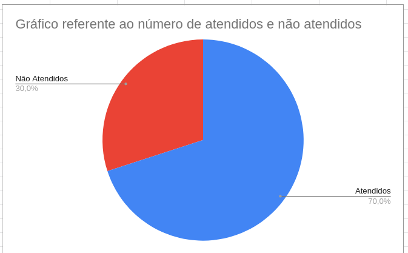

# Verificação das Personas

## 1. Introdução

Neste artefato será feita a verificação das
[_Personas_](/analise_de_requisitos/personas.md) utilizando a metodologia e as estratégias descritas no documento
de [_Verificação_](analise/verif_principal.md)

- Autor do documento: Leonardo Vitoriano.
- Inspetor: Cícero Fernandes.

## 2. Verificação

### 2.1 Preparação

O _checklist_ da tabela 1 foi montado para verificar a qualidade do artefato.

| Item                                                                                                   | Identificador |
| ------------------------------------------------------------------------------------------------------ | ------------- |
| As personas possuem identidade (nome, sobrenome, idade, foto)?                                         | 1             |
| As personas possuem status (primária, secundária, antipersona ou outro stakeholder)?                   | 2             |
| As personas possuem objetivos?                                                                         | 3             |
| As personas possuem habilidades/especialidades (educação, treinamento, competências específicas)?      | 4             |
| As personas possuem tarefas básicas ou críticas (frequência, duração, importância)?                    | 5             |
| As personas possuem relacionamentos?                                                                   | 6             |
| As personas possuem requisitos (citações que ajudam a entender melhor as necessidades daquela persona) | 7             |
| As personas possuem expectativas?                                                                      | 8             |
| As personas estão relacionadas ao perfil do usuário?                                                   | 9             |
| Legenda dos artefatos é especificada como figuras                                                      | 10            |

_Tabela 1: Itens e identificadores da verificação das personas_

### 2.2 Inspeção

A inspeção do artefato foi realizado pelo membro: Cícero Fernandes, no dia 22 de Agosto. Após a inspeção, a checklist foi construída e ela pode ser vista na Tabela 2.

| Identificador | Situação |
| ------------- | -------- |
| 1             | ✅       |
| 2             | ❌       |
| 3             | ✅       |
| 4             | ✅       |
| 5             | ❌       |
| 6             | ✅       |
| 7             | ✅       |
| 8             | ✅       |
| 9             | ✅       |
| 10            | ❌       |

_Tabela 2: checklist personas_

O gráfico de pizza compilando a porcentagem de itens atendidos e não atendidos consta na _figura 1_ abaixo.

|  |
| ----------------------------------------------------- |
| Figura 1: Gráfico de Itens atendidos e não atendidos  |

Como pode ser aferido pelo gráfico, a porcentagem de atendidos chega na marca de 70%, apresentando itens a melhorar no artefato, necessitando ser corrigido.

## Referências Bibliográficas

[1] Barbosa, S. D. J.; Silva, B. S. da; Silveira, M. S.; Gasparini, I.; Darin, T.; Barbosa, G. D. J. (2021)
Interação Humano-Computador e Experiência do usuário. Autopublicação. ISBN: 978-65-00-19677-1.R

## Histórico de Versões

| Versão  | Data         | Descrição                            | Autor             | Revisor   |
|---------|--------------|--------------------------------------|-------------------|-----------|
| 1.0     | 22/08/2022   | Escrita do documento de verificação  | Cícero Fernandes  | Guilherme |
