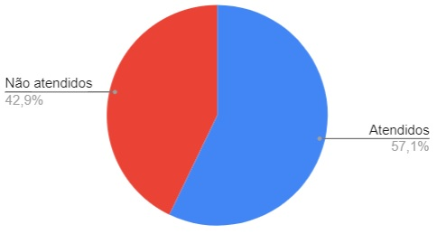

# Verificação do Planejamento da Análise de Tarefas

## 1. Introdução

Neste artefato será feita a verificação do
[_Planejamento da Análise de Tarefas_](/nivel1/planejamento_analise_tarefas.md) utilizando a metodologia e as estratégias descritas no documento
de [_Verificação_](../verif_principal.md)

- Autor do documento: Nícolas Georgeos Mantzos.
- Inspetor: Guilherme Brito.

## 2. Verificação

### 2.1 Preparação

O _checklist_ da tabela 1 foi montado para verificar a qualidade do artefato.

| Item                                                                                               | Identificador |
| -------------------------------------------------------------------------------------------------- | ------------- |
| Há uma seção introduzindo os objetivos da análise de tarefas bem como a teoria que lhe dá suporte? | 1             |
| Há seções apresentando as metodologias e como se dará a execução delas?                            | 2             |
| Mais de uma estratégia é utilizada para a realização da análise?                                   | 3             |
| As perguntas submetidas aos usuários são de claro entendimento?                                    | 4             |
| As perguntas submetidas aos usuários exploram diferentes aspectos do fluxo de tarefas?             | 5             |
| A descrição da execução da entrevista apresenta todas as etapas?                                   | 6             |
| A entrevista foi gravada?                                                                          | 7             |

_Tabela 1: Itens e identificadores da verificação do Planejamento da Análise de Tarefas_

### 2.2 Inspeção

A inspeção do artefato foi realizado pelo membro: Guilherme Brito, no dia 21 de Agosto às 17h. Após a inspeção, a
checklist foi construída e ela pode ser vista na _Tabela 2_.

| Identificador | Situação |
| ------------- | -------- |
| 1             | ✅       |
| 2             | ✅       |
| 3             | ❌       |
| 4             | ✅       |
| 5             | ✅       |
| 6             | ❌       |
| 7             | ❌       |

_Tabela 2: resultado do checklist_

O gráfico de pizza compilando a porcentagem de itens atendidos e não atendidos consta na _figura 1_ abaixo.

|  |
| -------------------------------------------------------------------------- |
| Figura 1: Gráfico de Itens atendidos e não atendidos                       |

Como a porcentagem de sucesso ficou pouco abaixo dos 60%, o artefato necessita de correções; sendo as mais emergenciais e agregadoras a adição
do vídeo da entrevista e o maior detalhamento de como ela foi realizada.

## Referências Bibliográficas

[1] Barbosa, S. D. J.; Silva, B. S. da; Silveira, M. S.; Gasparini, I.; Darin, T.; Barbosa, G. D. J. (2021)
Interação Humano-Computador e Experiência do usuário. Autopublicação. ISBN: 978-65-00-19677-1.R

## Histórico de Versões

| Versão  | Data       | Descrição                           | Autor           | Revisor         |
|---------|------------|-------------------------------------|-----------------|-----------------|
| 1.0     | 21/08/2022 | Escrita do documento de verificação | Guilherme Brito | Nícolas Mantzos |
