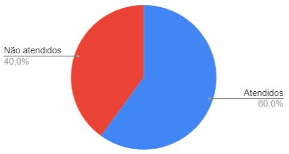

# Verificação do Planejamento da Avaliação do Protótipo de Papel

## 1. Introdução

Neste artefato será feita a verificação do
[*Planejamento da Avaliação do Protótipo em Papel*](/nivel2/planejamento_avaliacao_prototipo_papel.md) utilizando a metodologia e as estratégias descritas no documento
de [*Verificação*](../verif_principal.md)

- Autor(es) do documento: Arthur Lima e Cícero Fernandes
- Inspetor(es): Nícolas Georgeos Mantzos

## 2. Verificação

### 2.1 Preparação

O *checklist* da tabela 1 foi montado para verificar a qualidade do artefato.

| Item | Identificador |
| ------------ | -------- |
| Há uma seção introduzindo os objetivos do documento e a teoria que lhe dá suporte?         | 1        |
| As quatro etapas da prototipação em papel são explicadas?        | 2        |
| Há a previsão de realização de uma etapa de simulação?         | 3        |
| As tarefas destacadas são diversificadas?         | 4        |
| As tarefas destacadas são bem descritas?         | 5        |
_Tabela 1: Itens e identificadores da verificação do Planejamento da Avaliação do Protótipo em Papel_

### 2.2 Inspeção

O resultado do checklist dos itens levantados consta na _tabela 1_ abaixo.

| Identificador | Situação |
| --------- | -------- |
| 1         | ✅        |
| 2         | ❌        |
| 3         | ❌        |
| 4         | ✅        |
| 5         | ✅        |

O gráfico de pizza compilando a porcentagem de itens atendidos e não atendidos consta na _figura 1_ abaixo.

|  |
|---------------------------------------------------------|
| Figura 1: Gráfico de Itens atendidos e não atendidos    |

Como a porcentagem de sucesso ficou nos 60%, o artefato necessita de correções; sendo as mais emergenciais e agregadoras a previsão de uma 
etapa de simulação e a adição da quarta etapa prevista em [1].

## Referências Bibliográficas

[1] Barbosa, S. D. J.; Silva, B. S. da; Silveira, M. S.; Gasparini, I.; Darin, T.; Barbosa, G. D. J. (2021)
Interação Humano-Computador e Experiência do usuário. Autopublicação. ISBN: 978-65-00-19677-1.R

## Histórico de Versões

| Versão | Data       | Descrição           | Autor            |
| ------ | ---------- | ------------------- | ---------------- |
| 1.0    | 21/08/2022 | Escrita do documento de verificação | Nícolas Georgeos Mantzos |
