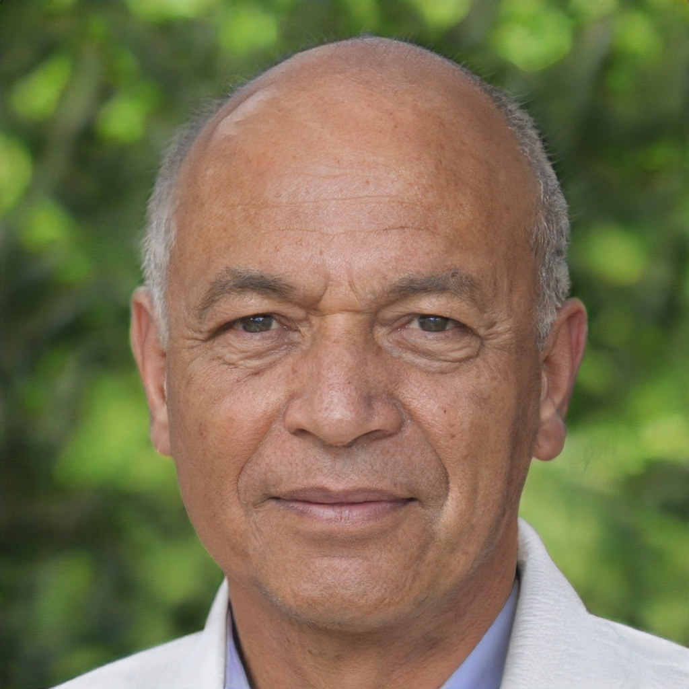

# 
 Personas

## 1. Introdução

A partir de um perfil do usuário bem definido, é possível então determinar as personas que serão utilizadas
para o sistema em destaque.

As personas são um grupo de pessoas fictícias, ou seja, um arquétipo de grupo que representam usuários reais.
Elas são entendidas principalmente por seus objetivos, os quais são determinados num processo de refinamentos sucessivos durante a investigação inicial do domínio de atividade do usuário. (Barbosa, 2021)

Para cada papel de usuário deve ser criado ao menos uma persona formando um elenco de personas para o projeto que consiste entre 3 a 12 personas distintas. A equipe determinou 3 personas e 1 antipersona para o site da PMDF. Sendo a antipersona responsável por representar o perfil de usuário que contrário ao público-alvo que utiliza o sistema.

## 2. Construção das Personas

Na construção das personas foi utilizado, principalmente, um perfil do usuário previamente definido, mas com a finalidade de visualizar as características e objetivos das personas, uma imagem é atribuída a cada persona. Essa imagem, a qual trata-se de uma pessoa que não existe, é gerada a partir de uma IA (Inteligência Artificial) do site ["this person does not exist"](https://thispersondoesnotexist.xyz/).

### Persona 1: Otavio Maranhão.

|    |
|:-----------------------------------------:|
|     Imagem 1: Persona Otavio Maranhão     |

Otavio Maranhão , policial militar - "bandido bom é bandido preso"

- Idade: 49.
- Sexo: Masculino.
- Profissão: Policial Militar.
- Escolaridade: Ensino Superior Completo.
- Expectativas: Deseja receber mais do que o salário atual.

Descrição: Otavio Maranhão tem 49 anos, é casado e desde que era criança sempre sonhou em ser policial militar tanto para proteger as pessoas quanto para prover boas condições para sua família. Ele reside com os esposa, 3 filhos e um cachorro. Devido ao sonho de Otavio em levar sua família para a Disney, ele está procurando por serviços voluntários dentro da PMDF, pois permite receber um bonus de dinheiro pela carga horária trabalhada além do comum. Ele não é um grande entusiasta da tecnologia, mas para agendar um voluntário, é necessário acessar o site da polícia militar de Brasília.

Objetivos pessoais:

- ganhar mais dinheiro
- viajar para Disney.

Objetivos práticos:

- conseguir agendar um voluntário.

### Persona 2: Josilane do Santos.

|  |
|:---------------------------------------:|
| Imagem 2: Persona Josilane do Santos    |

Josilane do Santos, bancária - "saúde em primeiro lugar"

- Idade: 49.
- Sexo: Feminino.
- Profissão: Bancária.
- Escolaridade: Ensino Superior Completo.
- Expectativas: Deseja receber assistência médica quando necessário.

Descrição: Josilane do Santos tem 49 anos, é casada e sua vida sempre foi muito difícil e sofrida pois seus pais não possuíam empregos fixos. Sabendo da dificuldade em que Josilane se encontrava, ela apostou nos estudos como forma de ascender socialmente, então formou-se em Administração e conseguiu emprego como bancária. Porém, mesmo com seu trabalho, não conseguiu pagar o tratamento de câncer da sua mãe em hospital particular, a qual faleceu tempos depois. Josilane é casada com um policial militar, e como é preocupada com a própria saúde, de seu marido e filho, ela busca manter as consultas médicas de todas atualizadas, através de marcação de consultas com o convênio de saúde do seu esposo.

Objetivos pessoais:

- manter a casa arrumada.
- cuidar da saúde própria e a da sua família.

Objetivos práticos:

- conseguir agendar uma consulta médica.

### Persona 3: Orlando Peixoto.

|  |
|:---------------------------------------:|
|  Imagem 3: Persona Orlando Peixoto      |

Orlando Peixoto, policial militar aposentado - "informação move o mundo"

- Idade: 60.
- Sexo: Masculino.
- Profissão: policial militar aposentado.
- Escolaridade: Ensino Superior Completo.
- Expectativas: Deseja acessar as notícias recentes sobre PMDF.

Descrição: Orlando Peixoto tem 60 anos, é viúvo e possui uma família grande e bastante acolhedora, no qual ele zela muito e busca ajudá-la quando possível. Devido ao seu grande interesse em notícias e informação, Orlando geralmente assiste programas notícias, como o Balanço Geral, DFTV e Band News TV. Mesmo com pouca afinidade com tecnologia, pediu para seu sobrinho lhe ensinar a acessar páginas na Internet, com objetivo de estar sempre informado e atualizado nos mais diversos assuntos.

Objetivos pessoais:

- estar informado das notícias mais recentes.

Objetivos práticos:

- conseguir acessar as notícias recentes sobre a PMDF.
- realizar agendamento médico.

### 2.4 Antipersona: Tiago Gonçalves:

|  |
|:------------------------------------------:|
| Imagem 4: Antipersona Tiago Gonçalves      |

Tiago Gonçalves, estudante - "programação não é mágica"

- Idade: 19.
- Sexo: Masculino.
- Profissão: Estudante.
- Escolaridade: Ensino Superior Incompleto.
- Expectativas: Deseja conseguir o diploma do curso.

Descrição: Tiago Gonçalves possui 19 anos, é estudante da Universidade de Brasília (UnB) e está no 3° semestre do curso de Engenharia de Software. Ele mora Taguatinga e compartilha seu apartamento com sua avó paterna. Tiago desde criança, sempre foi apaixonado por tecnologias em geral, demonstrando muita facilidade com a utilização dela, já desenvolvia os seus próprios códigos apenas por diversão. Motivado por essa paixão, ele almeja tornar-se um excelente profissional ná área de tecnologia e sonha até em morar fora do Brasil.

Objetivos pessoais:

- concluir o curso de graduação.
- ser bem sucedido na área de atuação.

## Referências Bibliográficas

Barbosa, S. D. J.; Silva, B. S. da; Silveira, M. S.; Gasparini, I.; Darin, T.; Barbosa, G. D. J. (2021)
Interação Humano-Computador e Experiência do usuário. Autopublicação. ISBN: 978-65-00-19677-1.R

https://thispersondoesnotexist.xyz/

## Histórico de Versões

| Versão   | Data        | Descrição                                     | Autor              | Revisor           |
|----------|-------------|-----------------------------------------------|--------------------|-------------------|
| 1.0      | 19/07/2022  | Criação da Introdução, Personas e Antipersona | Leonardo Vitoriano | Bernardo Pissutti |
