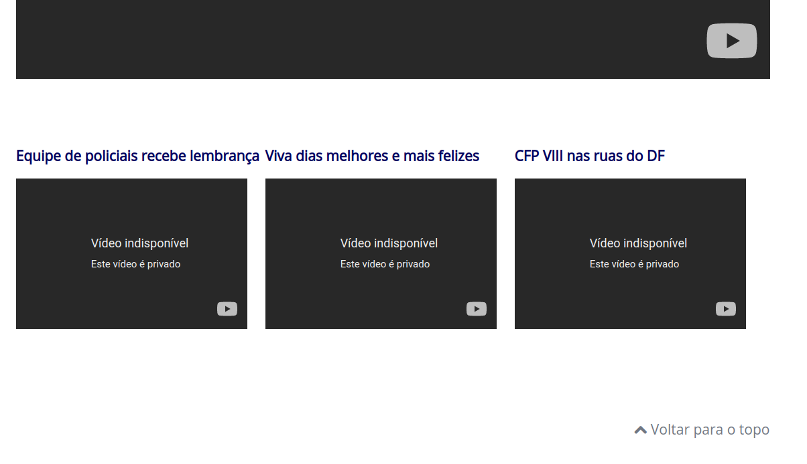
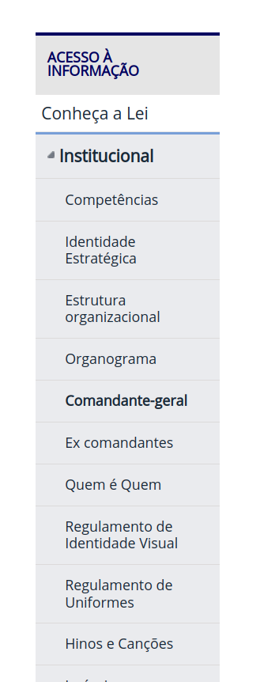

# 
 Princípios Gerais 

## 1. Introdução

Princípios, em IHC, são objetivos gerais e de alto nível, já diretrizes, são regras gerais comumente observadas na
prática. Embora princípios e diretrizes possam ser utilizados como auxílio ao design, elas não substituem um processo cuidadoso que
inclui a busca pelo entendimento do problema, a elaboração de soluções candidatas e a avaliação dessas
soluções alternativas. Os princípios e as diretrizes comumente utilizados em IHC giram em torno dos seguintes tópicos:
correspondência com as expectativas dos usuários; simplicidade nas estruturas das tarefas; equilíbrio
entre controle e liberdade do usuário; consistência e padronização; promoção da eficiência do usuário;
antecipação das necessidades do usuário; visibilidade e reconhecimento; conteúdo relevante e expressão
adequada; e projeto para erros. (Barbosa, 2021)

## 2. Tópicos dos princípios

Agora, serão apresentados os tópicos que os princípios e diretrizes giram em torno:

### 2.1 Correspondência com as Expectativas dos Usuários

Devemos nos certificar de que o usuário consegue determinar os
relacionamentos entre: intenções e ações possíveis; entre ações e seus efeitos no sistema; entre o estado
real do sistema e o que é percebido pela visão, audição ou tato; entre o estado percebido do sistema e as
necessidades, intenções e expectativas do usuário (Barbosa, 2021).
Segundo Nielsen (1994c), o projetista deve seguir as convenções do mundo real, fazendo
com que a informação apareça em uma ordem natural e lógica. Para isso, é importante entendermos as
sequências de ações que são familiares aos usuários e, caso a solução se desvie do que lhes é familiar, deve
ao menos refletir uma organização lógica que lhes seja plausível.

Levando em conta o sistema estudado nesse projeto, tem-se uma certa dificuldade de entender o fluxo do menu, por 
exemplo, a interface gera um submenu indesejado quando se clica em um item comum da página que nem no menu está, além disso, não é possível recolher esse submenu, dificultando o encontro de novos itens.

### 2.2 Simplicidade nas Estruturas das Tarefas

Norman (1988) recomenda simplificar a estrutura das tarefas, reduzindo a quantidade de planejamento e
resolução de problemas que elas requerem. Para simplificar a estrutura das tarefas, os designers podem
seguir quatro abordagens tecnológicas: a) manter a tarefa a mesma, mas fornecendo diversas formas de
apoio para que os usuários consigam aprender e realizar a tarefa; b) usar tecnologia para tornar visível o
que seria invisível, melhorando o feedback e a capacidade de o usuário se manter no controle da tarefa;
c) automatizar a tarefa ou parte dela, mantendo-a igual; e d) modificar a natureza da tarefa. (Barbosa, 2021)

### 2.3 Equilíbrio entre Controle e Liberdade do Usuário

O computador, a interface e o ambiente de trabalho “pertencem” ao usuário. Ele afirma que, quando deixamos o usuário “no comando”,
ele aprende rapidamente e ganha um sentimento de maestria. Entretanto, ele ressalta a necessidade de
buscar um equilíbrio, pois quando não há limites ou restrições os usuários podem se sentir perdidos ou
angustiados com o excesso de opções(Barbosa, 2021). Um exemplo é apresentar um fluxo para o usuário em que ele possa se sentir a vontade de sair daquela página ou continuar nela, ou cancelar um processo já iniciado, dão essa sensação de controle do usuário.

O sistema estudado não apresenta essa facilidade para voltar de uma página para outra, só a própria opção de voltar do navegador mesmo e, com um fluxo de carregamento demorado, não te dá opção para cancelar uma ação específica.

### 2.4 Consistência e Padronização

Norman, Tognazzini, Nielsen e Shneiderman recomendam padronizar as ações, os resultados das ações, o layout dos
diálogos e as visualizações de informação. Ações relacionadas em situações semelhantes devem funcionar
da mesma forma. Por exemplo, um botão Fechar não deve ser utilizado para cancelar um diálogo em
algumas situações e para confirmá-lo em outras. Os usuários não devem ter de se perguntar se palavras, situações ou ações diferentes significam a
mesma coisa. Por exemplo, utilizar rótulos Salvar e Gravar indiscriminadamente em um mesmo sistema
pode confundir o usuário. A mesma terminologia deve ser utilizada em perguntas, menus e sistemas de
ajuda. (Barbosa, 2021)

No sistema estudado, os direcionamentos dos menus levam para páginas que não seguem um padrão, por exemplo, muitas delas se apresentam com textos grandes, porém outras, são constituídas por caixas com tons de azuis diferentes do azul do sistema. E os submenus, quando abertos, não apresentam uma forma de serem fechados, dificultando o uso.

### 2.5 Eficiência do Usuário

Tognazzini recomenda considerar sempre a eficiência do usuário em primeiro lugar, e não a do computador. Isto é, uma economia de tempo e esforço do usuário costumam trazer mais benefícios do que economias semelhantes de processamento ou armazenamento no quesito de hardware. A sugestão de Tognazzini para isso é manter o usuário ocupado. 

Processos demorados não devem prender a interação, mas sim permitir que os usuários continuem seu trabalho com outras partes do sistema, deixando esses processos executando em background.

Tognazzini também defende que o designer deve proteger o trabalho dos usuários, Ou seja, os usuários nunca devem perder o seu trabalho, seja por um erro seu, por uma falha na transmissão de rede, uma falha no fornecimento de energia para o computador ou qualquer outra razão.

Outro ponto importante levantado por Cooper é que o sistema deve se lembrar de tudo o que o usuário disse, para não perguntar de novo e se manter informado sobre o usuário.

Para promover a eficiência de usuários frequentes, Nielsen e Shneiderman recomendam fornecer **atalhos** e **aceleradores**. Isso é importante pois à medida que a frequência de uso aumenta, aumenta também a vontade dos usuários de reduzir o número de interações e acelerar o passo da interação. Um exemplo disso é a utilização por parte de usuários mais experientes das teclas de atalho e comandos ocultos, e que não prejudicam a interação dos usuários novatos. Cypher e Lieberman trazem como sugestão a gravação de macros e programação por demonstração.

Diante de uma breve exposição ao site analisado, é visível que essas recomendações não são seguidas, pois não apresenta atalhos para o uso de usuários mais experientes, os únicos atalhos presentes são os atalhos de acessibilidade. Outro ponto observado é que em caso de lentidão, o usuário não é informado sobre o status do sistema (por exemplo: não há aviso se o usuário precisa aguardar ou se ele pode continuar na navegação).

### 2.6 Antecipação

Outro ponto importante a ser citado é o seguinte:
> As aplicações devem tentar prever o que o usuário quer e precisa, em vez de esperar que os usuários busquel ou coletem informações os invoquem ferramentas.

Tognazzini defende que o designer deve oferecer ao usuário todas as informações e ferramentas necessárias para cada passo do processo.

Segundo Cooper, o software deve tomar iniciativa e fornecer informações adicionais úteis, em vez de apenas responder precisamente a pergunta que o usuário tiver feito. Um exemplo disso é que ao perguntar sobre o telefone de um restaurante, o software também pode informar seus dias e horários de funcionamento.

Um outro cuidado que Tognazzini alerta é a escolha dos valores e configurações *defaults* pois os usuários tendem a aceitar esses valores para as opções que eles não entendem ou assumem que o sistema já aprendeu sobre elas ou que seja a resposta "certa". Por isso que a escolha deve ser cuidadosa.

### 2.7 Visibilidade e Reconhecimento

Normam afirma que o designer deve tornar as coisas visíveis: abreviar os golfos de execução e avaliação. Antes de executar uma ação, é necessário tornar visível para os usuários o que é possível realizar e como as ações devem ser feitas. Além disso, a interface não deve oferecer opções que não estejam disponíveis ou não falam sentido em um determinado momento da interação.

Nielsen, Shneiderman e Tognazzini afirmam que o estado do sistema, os objetos, as ações e as opções devem estar atualizados e facilmente perceptíveis.

Analisando o site escolhido, vemos que essas diretrizes não são seguidas pois na página principal existem diversos vídeos incorporados que estão indisponíveis, como podemos ver na imagem abaixo (Figura 1).

|                                                                               |
| :----------------------------------------------------------------------------------------------------------------------------: |
| Figura 1: Vídeos privados presentes na página principal, ferindo a diretriz de não oferecer opções que não estejam disponíveis |

Uma diretriz que o site segue é a de oferecer ao usuário um mapa de onde ele se encontra no momento e como ele fez para chegar a página atual. Esse "mapa" se encontra no menu lateral, como podemos ver na figura 2 abaixo.

|                                                    |
| :-------------------------------------------------------------------------------------------: |
| Figura 2: Mapa lateral que permite ao usuário identificar a página atual e o caminho da mesma |

### 2.8 Conteúdo relevante e Expressão adequada

Segundo Reeves e Nass, as pessoas dão tratamento humano para qualquer mídia ou tecnologia que apresente comportamento semelhante ao de uma pessoa, mesmo sabendo que isso é tolice e negando que tenham feito isso. Em paralelo com o princípio de Grice, eles destacam que uma interação polida segue quatro máximas:

1.  Máxima da Qualidade: Sem mentiras ou especulações.
2.  Máxima da Quantidade: "Menos é Mais".
3.  Máxima da Relação ou Relevância: Tudo que for dito deve ter relação clara com os tópicos da página atual e ser relevante aos usuários.
4.  Máxima do Modo ou Clareza:  Evitar a prolixidade e ambiguidade.

Nielsen, em conjunto com a máxima de quantidade, defende o projeto estético e minimalista. Afirma que os diálogos não devem conter informações que sejam irrelevantes ou raramente necessárias.

Tognazzini oferece uma série de recomendações para melhorar a redação em interfaces gráficas. As mensagens de instrução e ajuda devem ser concisas e informativas sobre problemas que ocorrerem. Os rótulos de menus e botões devem ser claros e livres de ambiguidade.

Além de cuidar do conteúdo, o designer deve se certificar que o texto também seja legível. Para a garantia disso, a fonte deve ser de alto contranste e favorecer texto preto sobre fundo branco ou amarelo-claro, evitando fundos de cor cinza (Tognazzini).

O site analisado segue algumas recomendações como a fonte preta sobre o fundo branco, porém um ponto notado foi a inutilidade da opção 'Alto Contraste' presente no canto da tela, mas que não oferece utilidade nenhuma.

### 2.9 Projeto para Erros

Norman recomenda projetar para o erro, ou seja, assumir que qualquer erro potencial será cometido. O designer deve ajudar o usuário a se recuperar de um erro, informando-lhe sobre o que ocorreu, as consequências disso e como reverter os resultados indesejados. Os sistemas devem ser exploráveis, isto é, fácil de reverter as operações e difícil realizar operações irreversíveis.

Dentre várias recomendações, podemos citar a recomendação de Cooper que defende o posicionamento correto de botões na interface para que controles de funções utilizadas com frequência não fiquem adjacentes a controles perigosos ou que raramente são utilizados.

Nielsen e Shneiderman recomendam que o designer tente evitar que os erros ocorram. Se um erro for cometido,  o sistema deve ser capaz de detectá-lo e oferecer mecanismos simples e inteligíveis para tratá-lo. O designer deve ajudar os usuários a reconhecerem, diagnosticarem e se recuperarem de erros. Além de erros, também é necessário o apoio aos usuários a esclarecem suas dúvidas durante a interação por meio de ajudas e documentações de alta qualidade. Essas informações devem ser de fácil acesso, focadas nas tarefas dos usuários, enumeradas com passos concretos e não muito extensas.

O site avaliado não possui uma documentação e não auxilia o usuário a chegar onde ele quer. As informações são soltas no menu lateral e não possuem uma breve descrição para auxiliar o usuário.

## Referências Bibliográficas

Barbosa, S. D. J.; Silva, B. S. da; Silveira, M. S.; Gasparini, I.; Darin, T.; Barbosa, G. D. J. (2021)
Interação Humano-Computador e Experiência do usuário. Autopublicação. ISBN: 978-65-00-19677-1.R

Nielsen, Jakob (1994c). Usability Engineering. Morgan Kaufmann Publishers Inc., San Francisco, CA,
USA.

Norman, Don (1988). The Psychology Of Everyday Things. Basic Books, New York, illustrated edition
edition.

## Histórico de Versões

| Versão | Data       | Descrição                     | Autor           |
| ------ | ---------- | ----------------------------- | --------------- |
| 1.0    | 28/07/2022 | Criação da página             | Cícero          |
| 1.1    | 29/07/2022 | Inserção de Tópicos 2.5 a 2.8 | Guilherme Brito |
| 1.2    | 30/07/2022 | Inserção de Tópicos 2.8 e 2.9 | Guilherme Brito |