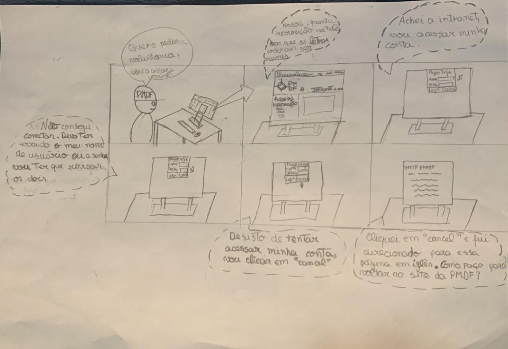

# 
 Storyboard

## Introdução

Este documento visa dissertar um pouco sobre a importância de Storyboard no contexto de IHC, seus elementos e apresentar os Storyboards feitos com base na análise de tarefas presente no artefato [Análise de Tarefas](analise_de_requisitos/analise_de_tarefas.md).

## Prototipação

Antes de tudo, é importante definir a importância da prototipação para sistemas construídos. Essa importância se deve ao fato de que os protótipos
são muito úteis quando se discutem ideias com stakeholders, pois são dispositivos que facilitam a comunicação entre os membros das equipes e consistem numa maneira eficaz de testar as ideias para você mesmo.
A atividade de construir protótipos encoraja a reflexão sobre o design. (Schon, 1983)

### Prototipação de Baixa Fidelidade

Um protótipo de baixa-fidelidade é aquele que não se assemelha muito ao produto final, porém são úteis porque tendem a ser simples, baratos (por conta dos materias que podem ser utilizados para a sua confecção) e de rápida produção.
Isso também significa que podem ser rapidamente modificados, oferecendo, suporte à exploração de designs e ideias alternativas. 

Essa vantagem é particularmente importante nos primeiros estágios de desenvolvimento - durante o design conceitual - pois nessa fase as diferentes ideias são discutidas e o fator flexibilização é importante nessa etapa.

Importante frizar que os protótipos de baixa-fidelidade nunca são projetados para ser mantidos e integrados ao produto final; servem apenas para exploração.

## Storyboard

O storyboard é um exemplo de prototipação de baixa-fidelidade, geralmente utilizado em conjunto com **cenários**;

Consiste em uma seŕie de desenhos mostrando como um usuário pode progredir em uma tarefa utilizando o produto que está sendo desenvolvido, podendo se tratar de uma série de telas esboçadas, no caso de um sistema de software baseado em GUI, ou de uma série de cenas desenhadas mostrando como um usuário pode desempenhar determinada tarefa utilizando um produto.

### Como aplicar?
> Primeiro, é preciso ter uma ideia bem definida do que comunicar e testar. Com base nisso, deve-se elaborar um roteiro por escrito e, em seguida, separar a história em seções, levando em conta:
> > - Cenários
> > - Atores
> > - Enquadramento

> Após essa análise, escolhe-se a técnica de representação gráfica mais adequada para o objetivo, podendo o resultado final ser impresso ou digital.

### Aplicação no trabalho

No contexto deste trabalho, foi feita a confecção de 2 storyboards para retratar as 2 tarefas elicitadas na etapa de [Análise de Tarefas](analise_de_requisitos/analise_de_tarefas.md).

#### [Tarefa 1: Logar na Intranet](analise_de_requisitos/analise_de_tarefas.md?id=_2-análise-hierárquica-de-tarefas-hta)

A figura a seguir (Figura 1) apresenta o storyboard referente a tarefa de Logar na Intranet.

|                                                                    |
|:------------------------------------------------------------------------------------------------------------------:|
| Figura 1: Storyboard referente a tarefa de Logar na Intranet  Autoria: Bernardo Pissutti (Integrante do Grupo) |

#### [Tarefa 2: Consultar Salário de Servidor](analise_de_requisitos/analise_de_tarefas.md?id=_3-goms-goals-operators-methods-and-selection-rules)

A figura a seguir (Figura 2) apresenta o storyboard referente a tarefa de Logar na Intranet.

|                                                                     |
|:------------------------------------------------------------------------------------------------------------------------------:|
|  Figura 2: Storyboard referente a tarefa de Consultar Salário de Servidor  Autoria: Guilherme Brito (Integrante do Grupo)  |

## Referências Bibliográficas

Barbosa, S. D. J.; Silva, B. S. da; Silveira, M. S.; Gasparini, I.; Darin, T.; Barbosa, G. D. J. (2021)
Interação Humano-Computador e Experiência do usuário. Autopublicação. ISBN: 978-65-00-19677-1.R

Vianna, Mauricio, et al - Design Thinking - Inovação em Negócios;

Rogers, Yvone - Design de Interação (capítulo 8);

## Histórico de Versões

| Versão | Data       | Descrição           | Autor           |
| ------ | ---------- |---------------------|-----------------|
| 1.0    | 07/08/2022 | Criação do Artefato | Guilherme Brito |
