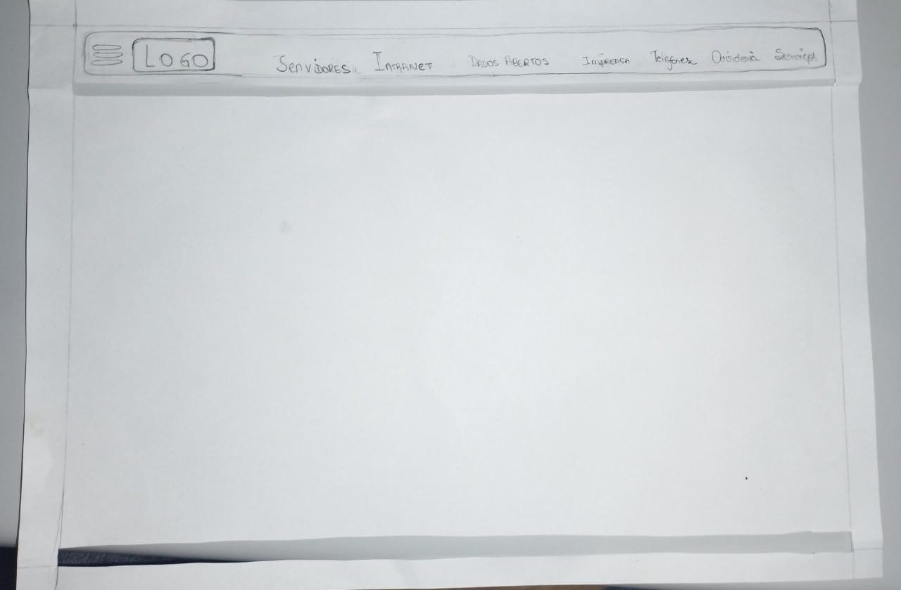
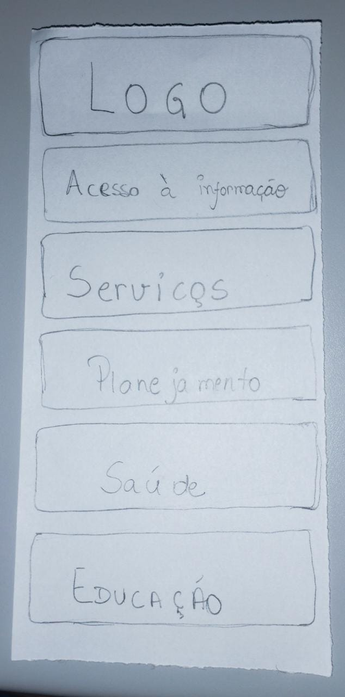
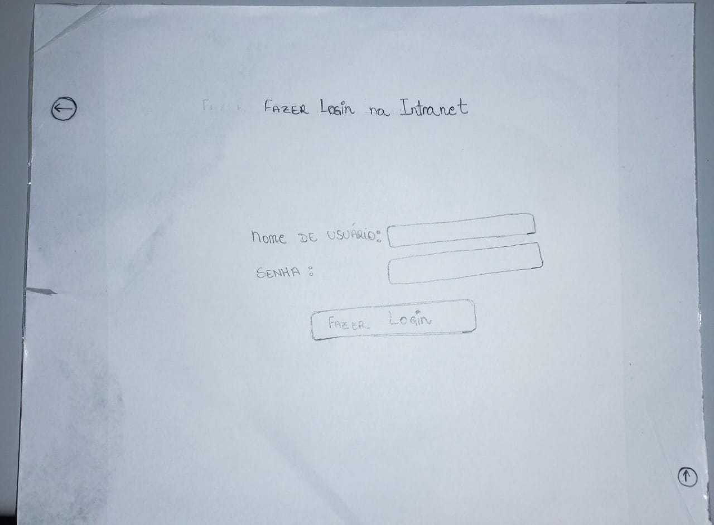
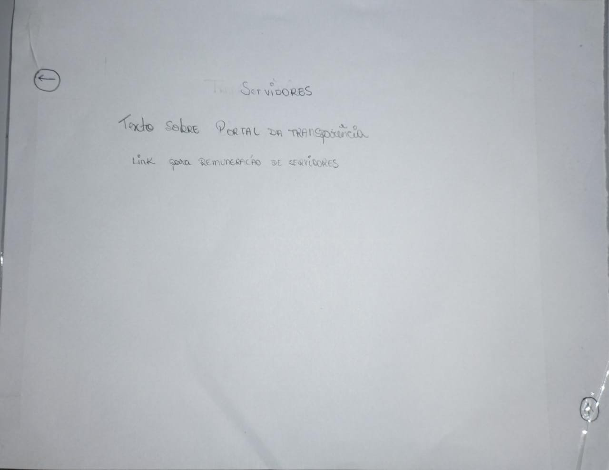
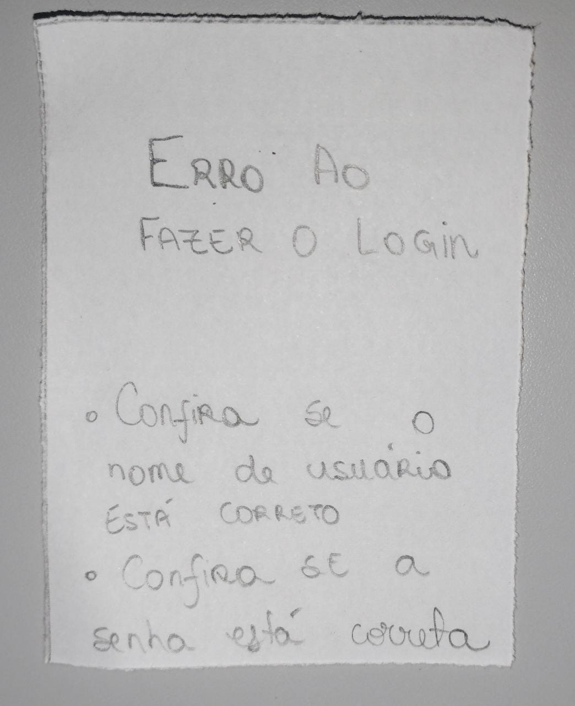

# Protótipo de Baixa Fidelidade

## 1. Introdução
O protótipo de baixa-fidelidade não se assemelha muito ao produto final. Eles são úteis porque tendem a ser simples,
baratos e de rápida produção. Isso também significa que podem ser rapidamente modificados, oferecendo, portanto, suporte
à exploração de designs e idéias alternativas.

## 2. Protótipo

Na tabela abaixo, podemos verificar os protótipos construídos utilizando de papel, lápis, tesoura, fita adesiva e grampeador.

|                                                               |                                                             |
|---------------------------------------------------------------|-------------------------------------------------------------|
| Tela principal  (Cabeçalho comum a todas as páginas)          |          |
| Tela principal  (Tela principal que simula a tela deslizante) |  |
| Menu                                                          |                    |
| Tela Intranet                                                 |           |
| Tela servidores                                               |         |
| Popup Intranet  (Caso acesso não for bem sucedido)            |          |

Tabela 1: Tabela contendo os artefatos contruídos que compõem o protótipo de papel.

## Referências Bibliográficas

Barbosa, S. D. J.; Silva, B. S. da; Silveira, M. S.; Gasparini, I.; Darin, T.; Barbosa, G. D. J. (2021)
Interação Humano-Computador e Experiência do usuário. Autopublicação. ISBN: 978-65-00-19677-1.R

## Histórico de Versões

| Versão | Data       | Descrição                                             | Autor             | Revisor           |
|--------|------------|-------------------------------------------------------|-------------------|-------------------|
| 1.0    | 02/09/2022 | Criação da introdução                                 | Bernardo Pissutti | Cícero Fernandes  |
| 1.1    | 05/09/2022 | Inserção das Imagens do Protótipo de Baixa Fidelidade | Guilherme Brito   | Cícero Fernandes  |