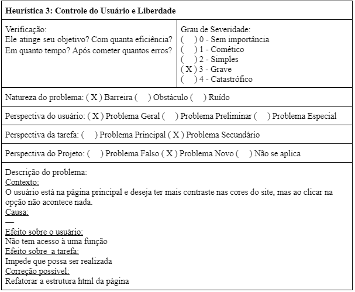
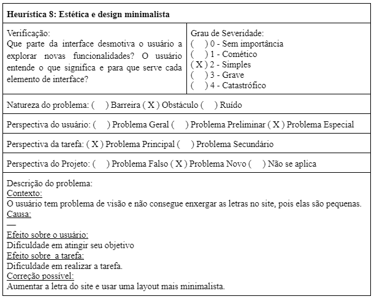
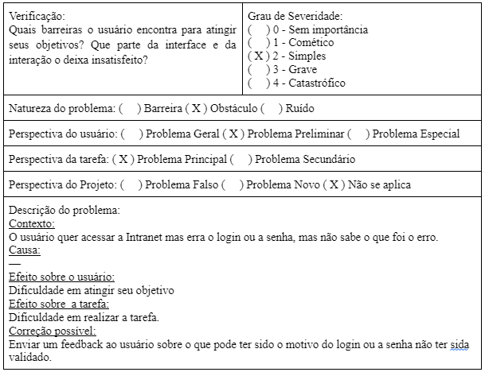
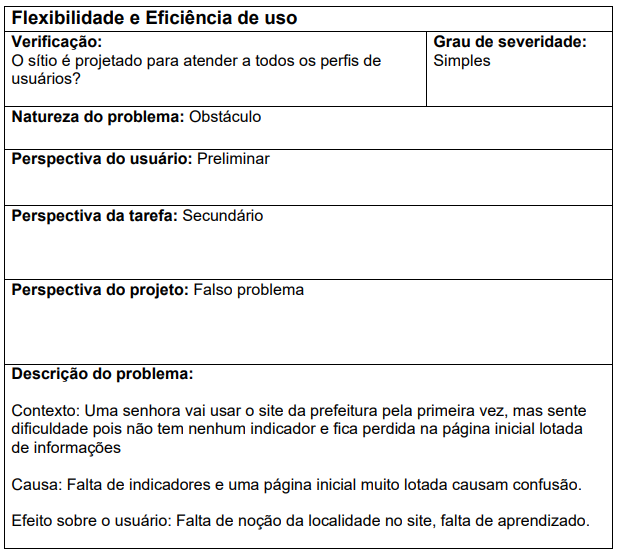

# Avaliação Heurística
A avaliação heurística é um método de avaliação de IHC criado para encontrar problemas de usabilidade durante um
processo de design iterativo (Nielsen e Molich, 1990; Nielse, 1992, 1994b). Esse método de avaliação orienta os 
avaliadores a inspecionar sistematicamente a interface em busca de problemas que prejudiquem a usabilidade.(Barbosa e Silva,p.281).

## 1. Avaliação do Site da PMDF
As _Figuras 1, 2, 3_ mostram a avaliação feita pelo integrante Bernardo Pissutti.

||
|:-----------------------------------------------:|
|                    Figura 1                     |

|  |
|:-------------------------------------------------:|
|                     Figura 2                      |

| |
|:-------------------------------------------------:|
|                     Figura 3                      |

## 2. Avaliação do Site da Prefeitura de Araranguá
As _Figuras 4, 5, 6, 7_ mostram a avaliação feita pelo integrante Cícero Fernandes.

|  |
|:-----------------------------------------------------------:|
|                          Figura 4                           |

|  |
|:-----------------------------------------------------------:|
|                          Figura 5                           |

|  |
|:-----------------------------------------------------------:|
|                          Figura 6                           |

|  |
|:-----------------------------------------------------------:|
|                          Figura 7                           |

## 3. Avaliação do Site da Prefeitura de Macaé
As _Figuras 8, 9, 10_ mostram a avaliação feita pelo integrante Leonardo Milomes.

|  |
|:-------------------------------------------------------:|
|                        Figura 8                         |

|  |
|:-------------------------------------------------------:|
|                        Figura 9                         |

|  |
|:-------------------------------------------------------:|
|                        Figura 10                        |

## 4. Avaliação do Site da Prefeitura de Águas Lindas
As _Figuras 11, 12_ mostram a avaliação feita pelo integrante Guilherme Brito.

|  |
|:-------------------------------------------------------------:|
|                           Figura 11                           |

|  |
|:-------------------------------------------------------------:|
|                           Figura 12                           |

## Referências Bibliograficas
Barbosa, S. D. J.; Silva, B. S. da; Silveira, M. S.; Gasparini, I.; Darin, T.; Barbosa, G. D. J. (2021)
Interação Humano-Computador e Experiência do usuário. Autopublicação. ISBN: 978-65-00-19677-1.R

## Histórico de Versões

| Versão | Data       | Descrição                    | Autor             |
|--------|------------|------------------------------|-------------------|
| 1.0    | 11/07/2022 | Criação da página            | Bernardo Pissutti |
| 1.1    | 17/07/2022 | Adição das outras avaliações | Bernardo Pissutti |
