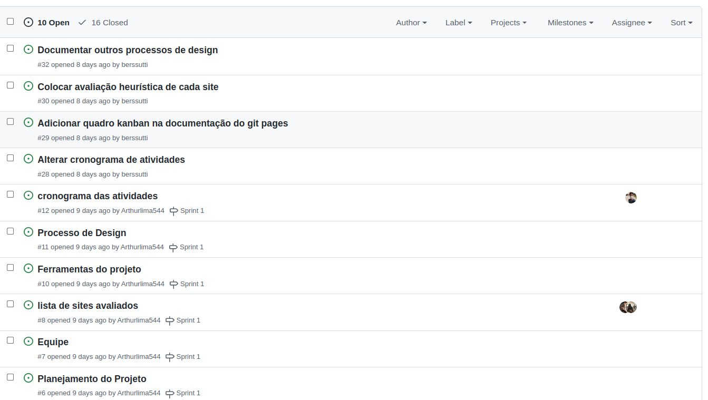
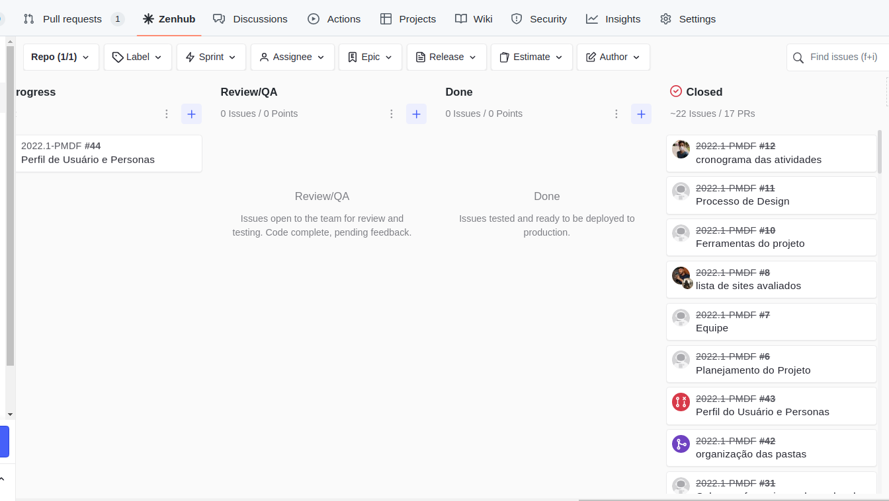
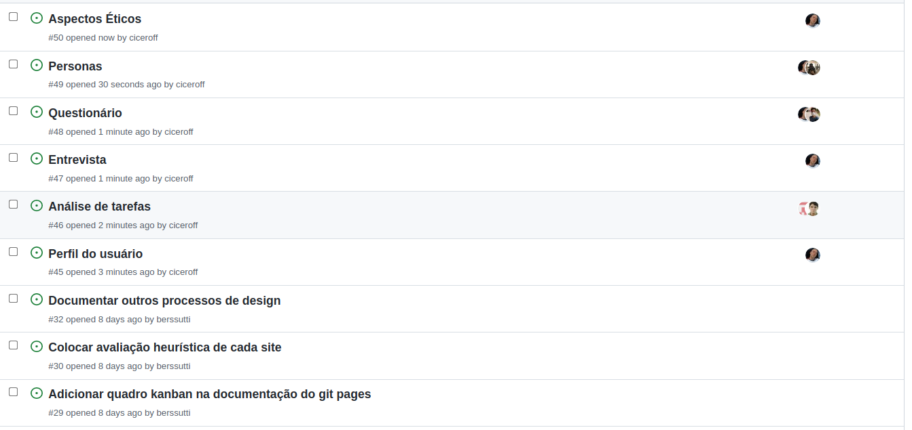
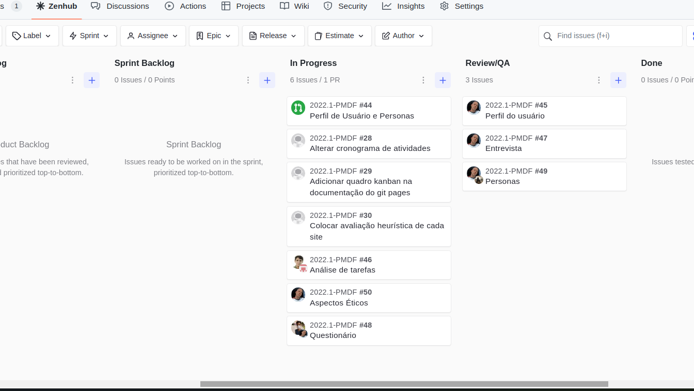

# Cronogramas

Planejamento das atividades para a disciplina de Interação Humano Computador, Semestre 2022.1.

## 1. Cronograma Geral das Atividades

O cronograma geral das atividades indica as atividades que serão executadas durante o período da disciplina, apresentado na tabela 1.

### 1.1 Entregas e Apresentações da disciplina

| Data  | Atividade                                                                                                                                                                                                                                                                            |
| ----- | ------------------------------------------------------------------------------------------------------------------------------------------------------------------------------------------------------------------------------------------------------------------------------------ |
| 11/07 | Entrega da apresentação do projeto etapa 1: Planejamento do Projeto, equipe, litas de sites avaliados, site selecionado para o projeto da disciplina, Ferramentas do projeto, Processo de Design, cronograma das atividades.                                                         |
| 12/07 | Apresentação do projeto etapa 1: planejamento do projeto e do Processo de Design                                                                                                                                                                                                     |
| 20/07 | Entrega da apresentação do projeto etapa 2: Perfil do usuário, Aspectos Éticos de Pesquisas Envolvendo Pessoas,Personas e Análise de tarefas                                                                                                                                         |
| 21/07 | Apresentação do projeto etapa 2: Perfil do usuário, Aspectos Éticos de Pesquisas com Pessoas, Personas e Análise de tarefas                                                                                                                                                          |
| 01/08 | Entrega da apresentação do projeto etapa 3: Princípios Gerais de Projeto, Metas de usabilidade, Guia de Estilo. (Fase: análise de requisitos)                                                                                                                                        |
| 02/08 | Apresentação do projeto etapa 3: Princípios Gerais de Projeto, Metas de usabilidade, Guia de Estilo. (Fase: análise de requisitos)                                                                                                                                                   |
| 09/08 | Apresentação do projeto etapa 4: : Planejamento da Avaliação do Storyboard e Análise de tarefas, planejamento do relato dos resultados da avaliação do Storyboard e o planejamento do relato dos resultados da avaliação do Análise de tarefas                                       |
| 11/08 | Entrega da apresentação do projeto etapa 4: Planejamento da Avaliação do Storyboard, o planejamento do relato dos resultados da avaliação do Storyboard,Planejamento da Avaliação do Análise de tarefas e o planejamento do relato dosresultados da avaliação do Análise de tarefas. |
| 17/08 | Entrega da apresentação do projeto 5: Relato dos resultados do Story Board e da Análise de tarefas, o Planejamento da Avaliação do Protótipo de Papel e do Planejamento do relato dos resultados da avaliação do Protótipo de Papel.                                                 |
| 18/08 | Apresentação do projeto etapa 5: Relato dos resultados do Story Board e da Análise de tarefas, o Planejamento da Avaliação do Protótipo de Papel e do planejamento do relato dos resultados da avaliação do Protótipo de Papel                                                       |
| 22/08 | Entrega da apresentação do projeto 6: Verificação dos artefatos                                                                                                                                                                                                                      |
| 23/08 | Apresentação do projeto etapa 6: Verificação dos artefatos                                                                                                                                                                                                                           |
| 22/08 | Entrega da apresentação do projeto 7: Relato dos resultados do Protótipo de Papel, o Planejamento da Avaliação do protótipo de alta fidelidade e o planejamento do relato dos resultados da avaliação do protótipo de alta fidelidade.                                               |
| 12/09 | Entrega da apresentação do projeto finals                                                                                                                                                                                                                                            |
| 06/09 | Apresentação do projeto etapa 7: Relato dos resultados do Protótipo de Papel, o Planejamento da Avaliação do protótipo de alta fidelidade e o Planejamento do relato dos resultados da avaliação do protótipo de alta fidelidade                                                     |

_Tabela 1: Cronograma geral_

## 2. Cronograma Específico das Atividades

O cronograma específico das atividades indica as Atividades de cada etapa do projeto de maneira detalhada.

### 2.1 Primeira Etapa Do projeto

A tabela 2 correspondente às atividades da primeira etapa do projeto no 11/07/2022.

| Data  | Atividade                 | Responsáveis        | Revisores |
| ----- | ------------------------- | ------------------- | --------- |
| 09/07 | Equipe                    | Nicolas             | Arthur    |
| 09/07 | Ferramentas               | Nicolas             | Guilherme |
| 09/07 | Processo de design        | Guilherme           | Bernardo  |
| 10/07 | Sites avaliados           | Cicero              | Leonardo  |
| 11/07 | Cronograma das atividades | Arthur              | Cicero    |
| 11/07 | Site Selecionado          | Leonardo e Bernardo | Nicolas   |
| 11/07 | Metodologia               | Leonardo            | Nicolas   |
| 11/07 | Avaliação Heurística      | Bernardo            | Leonardo  |

_Tabela 2: Primeira Etapa_

### 2.2 Segunda Etapa Do projeto

A tabela 3 correspondente às atividades da primeira etapa do projeto no 20/07/2022.

| Data  | Atividade                          | Responsáveis      | Revisores |
| ----- | ---------------------------------- |-------------------| --------- |
| 19/07 | Perfil do usuário                  | Leonardo          | Guilherme |
| 20/07 | Análise de tarefas                 | Arthur e Nicolas  | Bernardo  |
| 18/07 | Entrevista                         | Leonardo          | Nicolas   |
| 18/07 | Questionário                       | Leonardo e Arthur | Todos     |
| 19/07 | Personas                           | Leonardo          | Bernardo  |
| 19/07 | Aspectos éticos                    | Leonardo          | Todos     |
| 20/07 | Cronograma de atividades da equipe | Cícero            | Todos     |
| 20/07 | Gravação da entrega                | Todos             | Todos     |

_Tabela 3: Segunda Etapa_

## 3. Sprints

O quadro kaban e o roadmap são elementos que irão nos ajudar durante o desenvolvimento do projeto, explicados melhor na seção de metodologia. 
Nessa seção será apresentado o desenvolvimento dos dois com o passar das entregas.

### 3.1 Sprint 1

O backlog da sprint 1 está apresentado na _Figura 1_, e o seu quadro kanbak final apresentado na _Figura 2_ .

|  |
| ----------------------------------------- |
| _Figura 1: backlog da sprint 1_           |

|  |
| ---------------------------------------------- |
| _Figura 2: kaban da sprint 1_                  |

### 3.2 Sprint 2

O backlog da sprint 2 representado na _Figura 3_ e na _Figura 4_ o kanban board.

|  |
| ----------------------------------------- |
| _Figura 3: backlog da sprint 2_           |

|  |
| ---------------------------------------------- |
| _Figura 4: quadro kanban da sprint 2_          |

## Histórico de Versões

| Versão | Data       | Descrição                 | Autor  |
| ------ | ---------- | ------------------------- | ------ |
| 1.0    | 11/07/2022 | Criação dos Cronogramas   | Arthur |
| 1.1    | 20/07/2022 | Adição da segunda entrega | Cícero |
