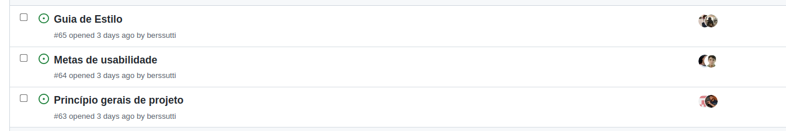
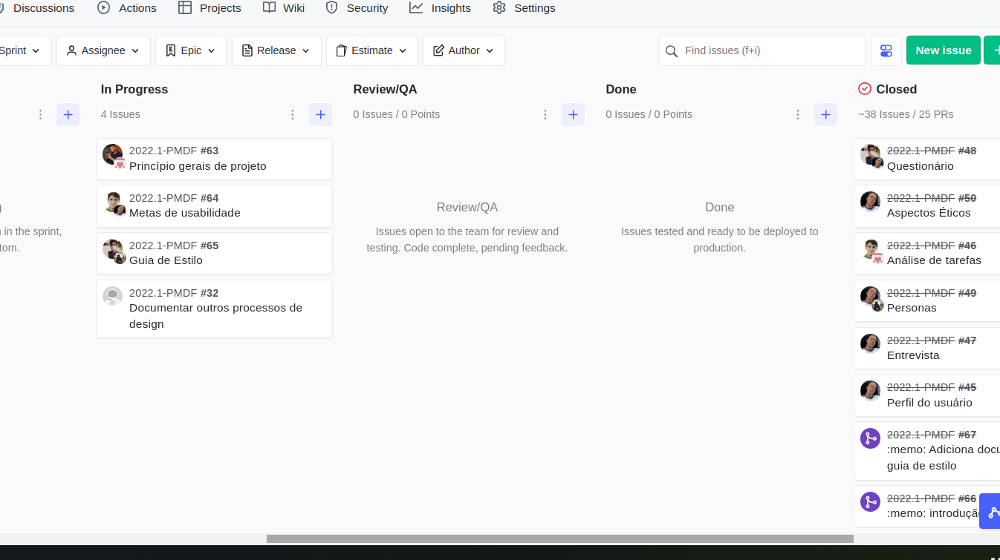
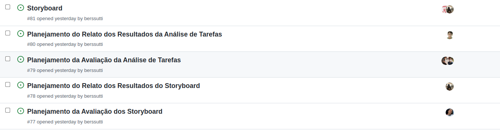
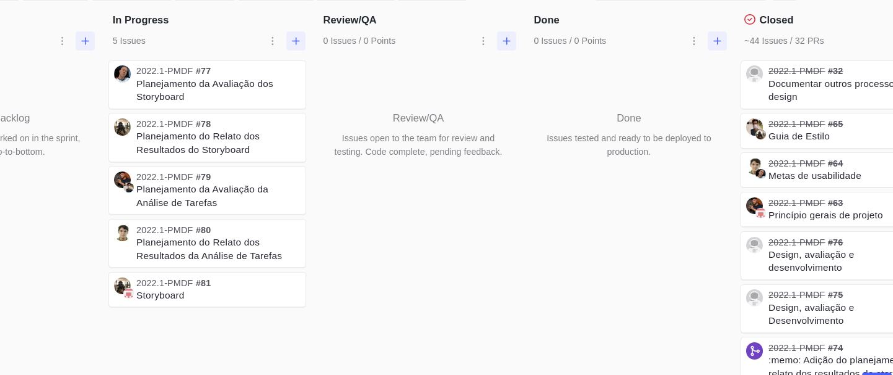
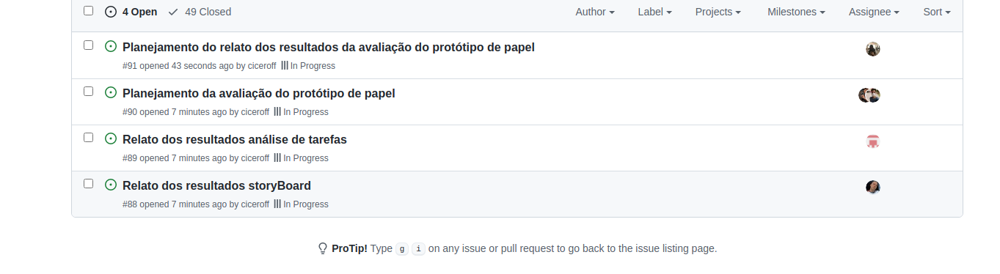
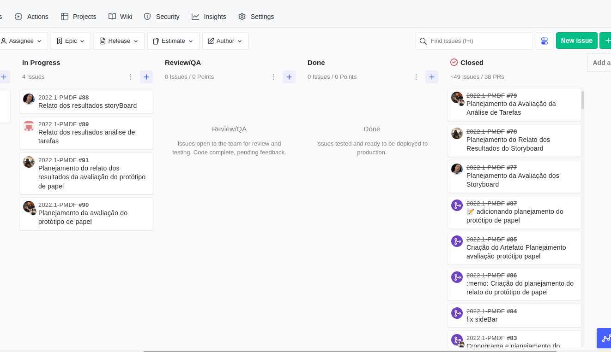
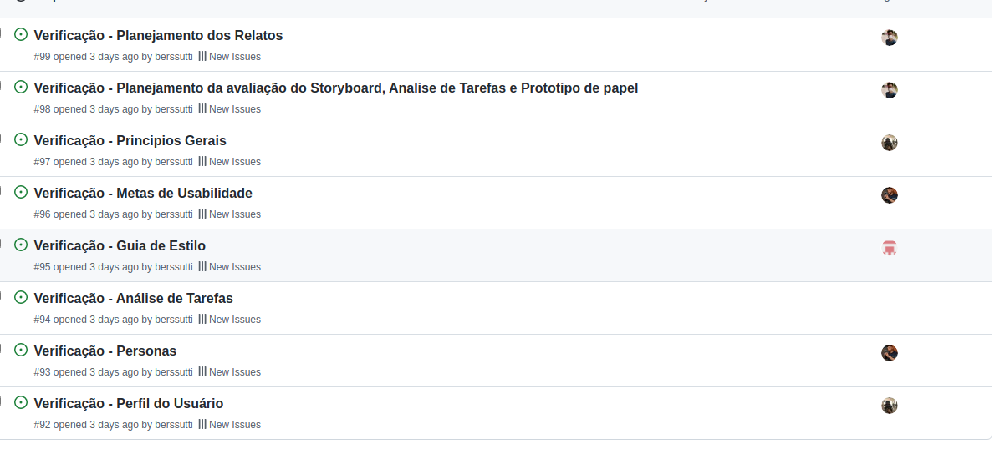
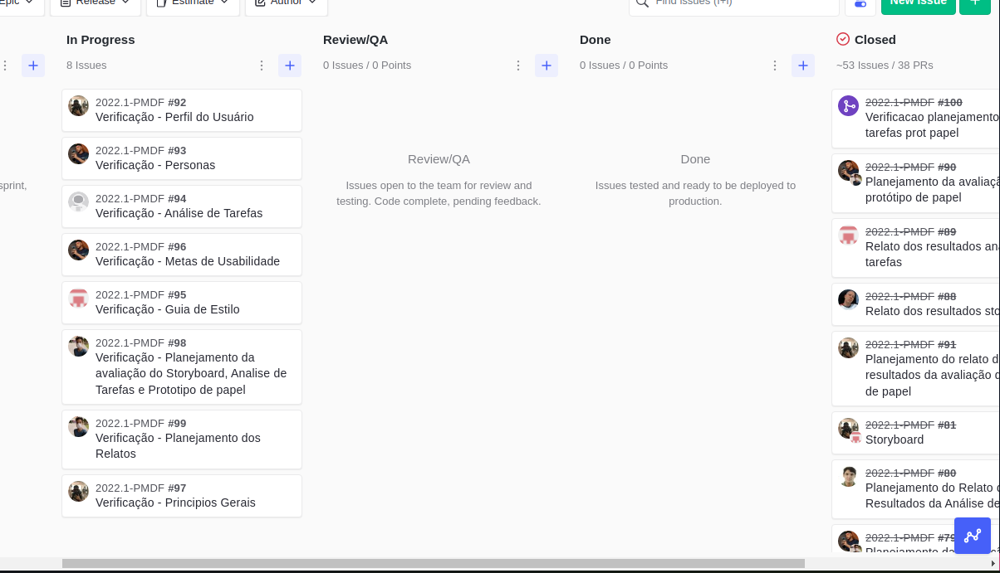
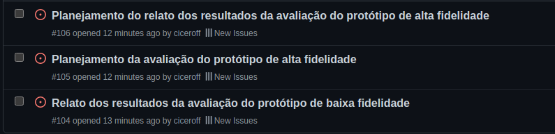
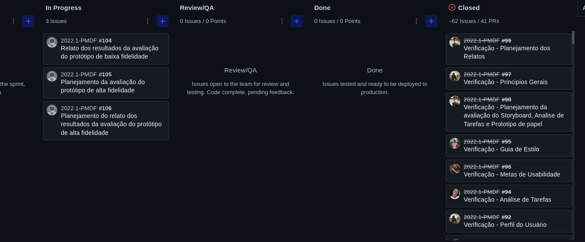

# Cronogramas

Planejamento das atividades para a disciplina de Interação Humano Computador, Semestre 2022.1.

## 1. Cronograma Geral das Atividades

O cronograma geral das atividades indica as atividades que serão executadas durante o período da disciplina, apresentado na tabela 1.

### 1.1 Entregas e Apresentações da disciplina

| Data  | Atividade                                                                                                                                                                                                                                                                             |
| ----- | ------------------------------------------------------------------------------------------------------------------------------------------------------------------------------------------------------------------------------------------------------------------------------------- |
| 11/07 | Entrega da apresentação do projeto etapa 1: Planejamento do Projeto, equipe, litas de sites avaliados, site selecionado para o projeto da disciplina, Ferramentas do projeto, Processo de Design, cronograma das atividades.                                                          |
| 12/07 | Apresentação do projeto etapa 1: planejamento do projeto e do Processo de Design                                                                                                                                                                                                      |
| 20/07 | Entrega da apresentação do projeto etapa 2: Perfil do usuário, Aspectos Éticos de Pesquisas Envolvendo Pessoas,Personas e Análise de tarefas                                                                                                                                          |
| 21/07 | Apresentação do projeto etapa 2: Perfil do usuário, Aspectos Éticos de Pesquisas com Pessoas, Personas e Análise de tarefas                                                                                                                                                           |
| 01/08 | Entrega da apresentação do projeto etapa 3: Princípios Gerais de Projeto, Metas de usabilidade, Guia de Estilo. (Fase: análise de requisitos)                                                                                                                                         |
| 02/08 | Apresentação do projeto etapa 3: Princípios Gerais de Projeto, Metas de usabilidade, Guia de Estilo. (Fase: análise de requisitos)                                                                                                                                                    |
| 09/08 | Apresentação do projeto etapa 4: : Planejamento da Avaliação do Storyboard e Análise de tarefas, planejamento do relato dos resultados da avaliação do Storyboard e o planejamento do relato dos resultados da avaliação do Análise de tarefas                                        |
| 11/08 | Entrega da apresentação do projeto etapa 4: Planejamento da Avaliação do Storyboard, o planejamento do relato dos resultados da avaliação do Storyboard,Planejamento da Avaliação do Análise de tarefas e o planejamento do relato dos resultados da avaliação do Análise de tarefas. |
| 17/08 | Entrega da apresentação do projeto 5: Relato dos resultados do Story Board e da Análise de tarefas, o Planejamento da Avaliação do Protótipo de Papel e do Planejamento do relato dos resultados da avaliação do Protótipo de Papel.                                                  |
| 18/08 | Apresentação do projeto etapa 5: Relato dos resultados do Story Board e da Análise de tarefas, o Planejamento da Avaliação do Protótipo de Papel e do planejamento do relato dos resultados da avaliação do Protótipo de Papel                                                        |
| 22/08 | Entrega da apresentação do projeto 6: Verificação dos artefatos                                                                                                                                                                                                                       |
| 23/08 | Apresentação do projeto etapa 6: Verificação dos artefatos                                                                                                                                                                                                                            |
| 22/08 | Entrega da apresentação do projeto 7: Relato dos resultados do Protótipo de Papel, o Planejamento da Avaliação do protótipo de alta fidelidade e o planejamento do relato dos resultados da avaliação do protótipo de alta fidelidade.                                                |
| 12/09 | Entrega da apresentação do projeto finals                                                                                                                                                                                                                                             |
| 06/09 | Apresentação do projeto etapa 7: Relato dos resultados do Protótipo de Papel, o Planejamento da Avaliação do protótipo de alta fidelidade e o Planejamento do relato dos resultados da avaliação do protótipo de alta fidelidade                                                      |

_Tabela 1: Cronograma geral_

## 2. Cronograma Específico das Atividades

O cronograma específico das atividades indica as Atividades de cada etapa do projeto de maneira detalhada.

### 2.1 Primeira Etapa Do projeto

A tabela 2 correspondente às atividades da primeira etapa do projeto no 11/07/2022.

| Data  | Atividade                 | Responsáveis        | Revisores |
| ----- | ------------------------- | ------------------- | --------- |
| 09/07 | Equipe                    | Nicolas             | Arthur    |
| 09/07 | Ferramentas               | Nicolas             | Guilherme |
| 09/07 | Processo de design        | Guilherme           | Bernardo  |
| 10/07 | Sites avaliados           | Cicero              | Leonardo  |
| 11/07 | Cronograma das atividades | Arthur              | Cicero    |
| 11/07 | Site Selecionado          | Leonardo e Bernardo | Nicolas   |
| 11/07 | Metodologia               | Leonardo            | Nicolas   |
| 11/07 | Avaliação Heurística      | Bernardo            | Leonardo  |

_Tabela 2: Primeira Etapa_

### 2.2 Segunda Etapa Do projeto

A tabela 3 correspondente às atividades da segunda etapa do projeto no 20/07/2022.

| Data  | Atividade                          | Responsáveis      | Revisores |
| ----- | ---------------------------------- | ----------------- | --------- |
| 19/07 | Perfil do usuário                  | Leonardo          | Guilherme |
| 20/07 | Análise de tarefas                 | Arthur e Nicolas  | Bernardo  |
| 18/07 | Entrevista                         | Leonardo          | Nicolas   |
| 18/07 | Questionário                       | Leonardo e Arthur | Todos     |
| 19/07 | Personas                           | Leonardo          | Bernardo  |
| 19/07 | Aspectos éticos                    | Leonardo          | Todos     |
| 20/07 | Cronograma de atividades da equipe | Cícero            | Todos     |
| 20/07 | Gravação da entrega                | Todos             | Todos     |

_Tabela 3: Segunda Etapa_

### 2.3 Terceira Etapa Do projeto

A tabela 4 correspondente às atividades da terceira etapa do projeto no 01/08/2022.

| Data  | Atividade                      | Responsáveis       | Revisores          |
| ----- | ------------------------------ | ------------------ | ------------------ |
| 28/07 | Princípios gerais              | Cícero e Guilherme | Bernardo e Arthur  |
| 29/07 | Guia de estilo                 | Bernardo e Arthur  | Nicolas e Leonardo |
| 29/07 | Metas de Usabilidade           | Nicolas e Leonardo | Guilherme e Cícero |
| 28/07 | Cronograma de entrega sprint 3 | Cícero             | Todos              |
| 30/07 | Gravação da entrega            | Todos              | Todos              |

_Tabela 4: Terceira Etapa_

### 2.4 Quarta Etapa Do projeto

A tabela 5 correspondente às atividades da quarta etapa do projeto no 08/08/2022.

| Data          | Atividade                                                 | Responsáveis        | Revisores            |
| ------------- | --------------------------------------------------------- | ------------------- | -------------------- |
| 08/08         | Planejamento do relato da avaliação da análise de tarefas | Cícero e Arthur     | Bernardo e Guilherme |
| 08/08         | Planejamento da avaliação do storyboard                   | Leonardo            | Cícero               |
| 07/08 - 08/08 | Planejamento de avaliação da análise de tarefas           | Nicolas             | Leonardo             |
| 07/08         | Planejamento do relato do storyboard                      | Bernardo            | Arthur               |
| 08/08         | Storyboard                                                | Guilherme, Bernardo | Nícolas              |
| 08/08         | Cronograma de entrega sprint 4                            | Cícero              | Todos                |
| 08/08         | Gravação da entrega                                       | Todos               | Todos                |

_Tabela 5: Quarta Etapa_

### 2.5 Quinta Etapa Do projeto

A tabela 6 correspondente às atividades da quinta etapa do projeto no 17/08/2022.

| Data  | Atividade                                                                | Responsáveis    | Revisores |
| ----- | ------------------------------------------------------------------------ | --------------- | --------- |
| 17/08 | Construção do cronograma de atividades                                   | Cícero          | Todos     |
| 17/08 | Relato dos resultados story board                                        | Leonardo        | Cícero    |
| 17/08 | Relato dos resultados análise de tarefas                                 | Guilherme       | Nicolas   |
| 12/08 | Planejamento da avaliação do protótipo de papel                          | Cícero e Arthur | Guilherme |
| 08/08 | Planejamento do relato dos resultados da avaliação do protótipo de papel | Bernardo        | Nícolas   |
| 17/08 | Gravação da entrega                                                      | Todos           | Todos     |

_Tabela 6: Quinta Etapa_

### 2.6 Sexta Etapa Do projeto

A tabela 7 correspondente às atividades da sexta etapa do projeto no 22/08/2022.

| Data  | Atividade                                                   | Responsáveis | Revisores |
| ----- | ----------------------------------------------------------- | ------------ | --------- |
| 22/08 | Construção do cronograma de atividades                      | Cícero       | Todos     |
| 22/08 | Verificação planejamento dos relatos                        | Arthur       | Leonardo  |
| 22/08 | Verificação planejamento da avaliação do storyboard         | Arthur       | Nicolas   |
| 21/08 | Verificação planejamento da avaliação da análise de tarefa  | Guilherme    | Nicolas   |
| 21/08 | Verificação planejamento da avaliação do protótipo de papel | Nicolas      | Leonardo  |
| 20/08 | Verificação Princípios gerais                               | Bernardo     | Arthur    |
| 22/08 | Verificação metas de usabilidade                            | Cícero       | Bernardo  |
| 21/08 | Verificação Guia de estilo                                  | Guilherme    | Cícero    |
| 21/08 | Verificação análise de tarefa                               | Leonardo     | Nicolas   |
| 21/08 | Verificação storyboards                                     | Leonardo     | Guilherme |
| 22/08 | Verificação personas                                        | Cícero       | Guilherme |
| 20/08 | Verificação perfil do usuário                               | Bernardo     | Cícero    |
| 22/08 | Gravação da entrega                                         | Todos        | Todos     |

_Tabela 7: Sexta Etapa_

### 2.7 Sétima Etapa Do projeto

A tabela 8 correspondente às atividades da sexta etapa do projeto no 05/09/2022.

| Data  | Atividade                                                 | Responsáveis                                           | Revisores |
| ----- | --------------------------------------------------------- | ------------------------------------------------------ | --------- |
| 05/09 | Construção do cronograma de atividades                    | Cícero                                                 | Todos     |
| 22/08 | Construção do protótipo de papel                          | Guilherme                                              | Cícero    |
| 05/09 | Avaliação protótipo de papel                              | Guilherme                                              | Bernardo  |
| 05/09 | Documentação do teste piloto de baixa fidelidade          | Arthur                                                 | Nicolas   |
| 05/09 | Documentação do teste piloto de alta fidelidade           | Cícero                                                 | Guilherme |
| 05/09 | Relato do protótipo de baixa fidelidade                   | Arthur                                                 | Cícero    |
| 05/09 | Relato do protótipo de alta fidelidade                    | Cícero                                                 | Guilherme |
| 03/09 | Teste piloto avaliação do protótipo de baixa fidelidade   | Guilherme e Bernardo                                   | Arthur    |
| 04/09 | Teste piloto avaliação do protótipo de alta fidelidade    | Guilherme e Bernardo                                   | Arthur    |
| 30/08 | Planejamento da avaliação do protótipo de alta fidelidade | Leonardo                                               | Cícero    |
| 30/08 | Gravação da entrega                                       | Cícero, Bernardo, Leonardo, Arthur, Guilherme, Nicolas | Todos     |

_Tabela 8: Sétima Etapa_

## 3. Sprints

O quadro kaban e o roadmap são elementos que irão nos ajudar durante o desenvolvimento do projeto, explicados melhor na seção de metodologia.
Nessa seção será apresentado o desenvolvimento dos dois com o passar das entregas.

### 3.1 Sprint 1

O backlog da sprint 1 está apresentado na _Figura 1_, e o seu quadro kanbak final apresentado na _Figura 2_ .

|                 |
| -------------------------------------------------------- |
| _Figura 1: backlog da sprint 1; Fonte: autoria própria._ |

|          |
| ------------------------------------------------------ |
| _Figura 2: kaban da sprint 1; Fonte: autoria própria._ |

### 3.2 Sprint 2

O backlog da sprint 2 representado na _Figura 3_ e na _Figura 4_ o kanban board.

|                 |
| -------------------------------------------------------- |
| _Figura 3: backlog da sprint 2; Fonte: autoria própria._ |

|                  |
| -------------------------------------------------------------- |
| _Figura 4: quadro kanban da sprint 2; Fonte: autoria própria._ |

### 3.3 Sprint 3

O backlog da sprint 3 representado na _Figura 5_ e na _Figura 6_ o kanban board.

|                 |
| -------------------------------------------------------- |
| _Figura 5: backlog da sprint 3; Fonte: autoria própria._ |

|                  |
| -------------------------------------------------------------- |
| _Figura 6: quadro kanban da sprint 3; Fonte: autoria própria._ |

### 3.4 Sprint 4

O backlog da sprint 4 representado na _Figura 7_ e na _Figura 8_ o kanban board.

|                 |
| -------------------------------------------------------- |
| _Figura 7: backlog da sprint 4; Fonte: autoria própria._ |

|                  |
| -------------------------------------------------------------- |
| _Figura 8: quadro kanban da sprint 4; Fonte: autoria própria._ |

### 3.5 Sprint 5

O backlog da sprint 5 representado na _Figura 9_ e na _Figura 10_ o kanban board.

|                 |
| -------------------------------------------------------- |
| _Figura 9: backlog da sprint 5; Fonte: autoria própria._ |

|                   |
| --------------------------------------------------------------- |
| _Figura 10: quadro kanban da sprint 5; Fonte: autoria própria._ |

### 3.6 Sprint 6

O backlog da sprint 6 representado na _Figura 11_ e na _Figura 12_ o kanban board.

|                  |
| --------------------------------------------------------- |
| _Figura 11: backlog da sprint 6; Fonte: autoria própria._ |

|                   |
| --------------------------------------------------------------- |
| _Figura 12: quadro kanban da sprint 6; Fonte: autoria própria._ |

### 3.7 Sprint 7

O backlog da sprint 7 representado na _Figura 13_ e na _Figura 14_ o kanban board.

|                  |
| --------------------------------------------------------- |
| _Figura 11: backlog da sprint 7; Fonte: autoria própria._ |

|                   |
| --------------------------------------------------------------- |
| _Figura 12: quadro kanban da sprint 7; Fonte: autoria própria._ |

## Histórico de Versões

| Versão | Data       | Descrição                  | Autor  | Revisor |
| ------ | ---------- | -------------------------- | ------ | ------- |
| 1.0    | 11/07/2022 | Criação dos Cronogramas    | Arthur | Cicero  |
| 1.1    | 20/07/2022 | Adição da segunda entrega  | Cícero | Todos   |
| 1.2    | 28/07/2022 | Adição da Terceira entrega | Cícero | Todos   |
| 1.3    | 08/08/2022 | Adição da Quarta entrega   | Cícero | Todos   |
| 1.4    | 17/08/2022 | Adição da Quinta entrega   | Cícero | Todos   |
| 1.5    | 22/08/2022 | Adição da Sexta entrega    | Cícero | Todos   |
| 1.6    | 22/08/2022 | Adição da Sétima entrega   | Cícero | Todos   |
